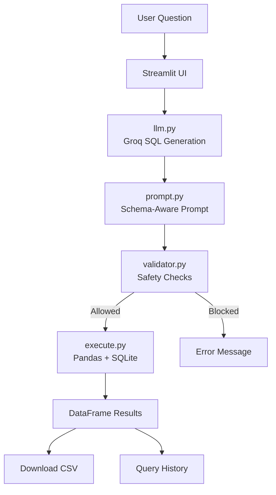
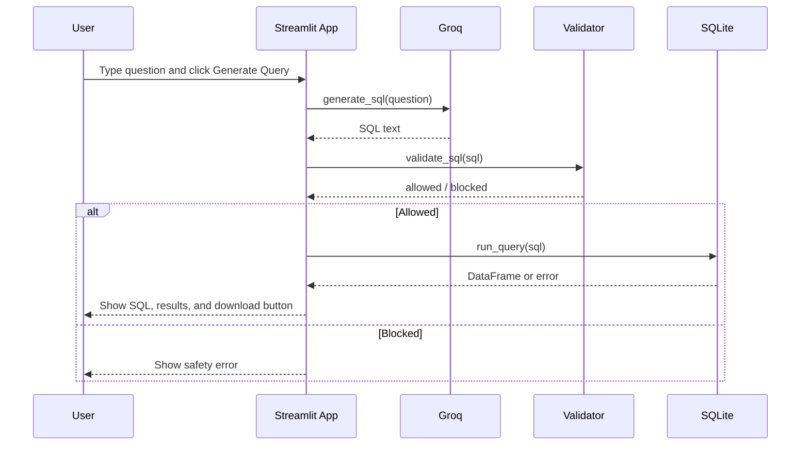
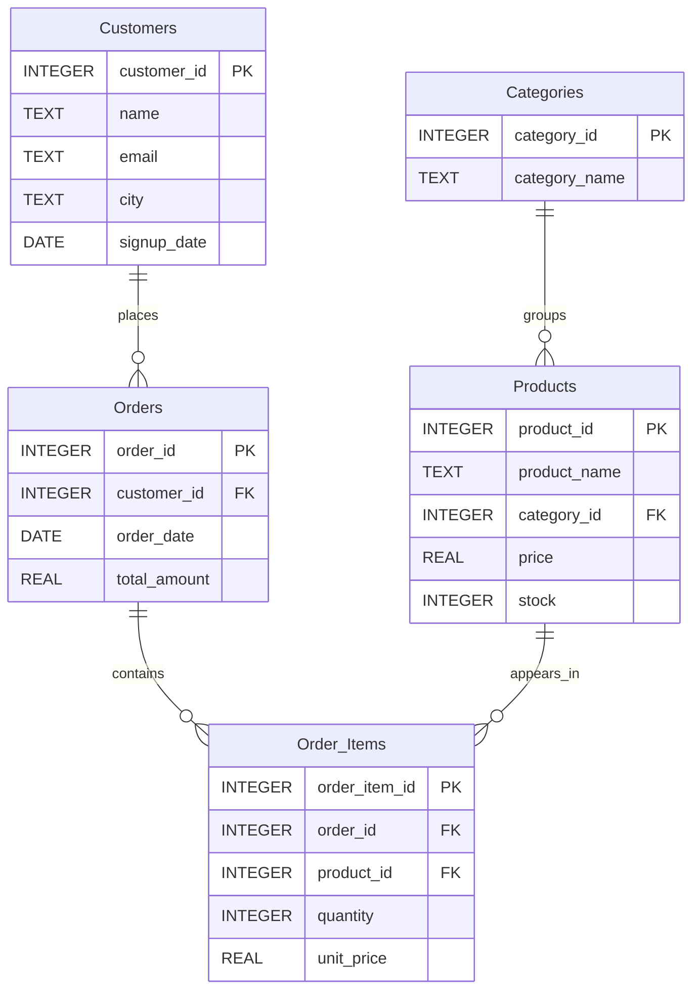

# SenseQL

> Natural language to SQL assistant with Groq, SQLite, Pandas, and Streamlit.

<p align="center">
  
  
  
  
</p>

## Overview

SenseQL turns an English question into safe SQL, runs it against a local SQLite database, and renders the result in a clean Streamlit interface. It is built to demonstrate a complete data-to-answer workflow:

1. User asks a question in natural language.
2. Groq generates SQLite SQL.
3. A safety layer validates the query.
4. SQLite executes the query.
5. Pandas formats the result.
6. Streamlit displays the data and offers CSV export.

## System Architecture



## Query Lifecycle



## Features

- Natural language to SQL generation using Groq.
- Schema-aware prompting for better query accuracy.
- SQL safety validation before execution.
- SQLite execution with Pandas DataFrames.
- Friendly database error messages.
- Query history in the sidebar.
- CSV export for result sets.
- Local-first architecture with a single SQLite database file.

## Tech Stack

- Python
- Streamlit
- Groq Python SDK
- SQLite
- Pandas
- python-dotenv

## Project Structure

```text
SenseQL/
├── app.py
├── config.py
├── database.py
├── execute.py
├── llm.py
├── prompt.py
├── validator.py
├── requirements.txt
├── README.md
├── .env
├── database/
│   ├── company.db
│   ├── create_db.py
│   └── populate_db.py
├── schema/
│   └── schema.txt
├── assets/
└── screenshots/
```

## Database Model



## Core Modules

### `llm.py`

- Reads the schema from `schema/schema.txt`.
- Builds the final LLM prompt.
- Calls Groq.
- Cleans code fences from the response.
- Returns SQL only.

### `prompt.py`

- Keeps prompt engineering centralized.
- Tells the model to behave like an SQLite expert.
- Forces a no-Markdown, SQL-only response.

### `validator.py`

- Allows only `SELECT` and `WITH` statements.
- Blocks destructive keywords like `DROP`, `DELETE`, and `UPDATE`.
- Rejects multiple SQL statements.

### `database.py`

- Opens and closes the SQLite connection.
- Sets the row factory for SQLite compatibility.
- Enables foreign key enforcement.

### `execute.py`

- Executes validated SQL.
- Returns Pandas DataFrames.
- Converts SQLite failures into readable error messages.

### `app.py`

- Hosts the Streamlit interface.
- Manages query history.
- Displays generated SQL.
- Renders results.
- Provides CSV download.

## Safety Rules

The validator is intentionally strict.

| Rule | Behavior |
| --- | --- |
| Allowed statements | `SELECT`, `WITH` |
| Blocked statements | `DROP`, `DELETE`, `UPDATE`, `INSERT`, `ALTER`, `TRUNCATE` |
| Multi-statement SQL | Rejected |
| Empty SQL | Rejected |

This prevents the LLM from directly modifying or destroying data.

## Setup

### 1. Install dependencies

```powershell
c:/Users/DELL/Documents/SenseQL/venv/Scripts/python.exe -m pip install -r requirements.txt
```

### 2. Configure environment variables

Create or update `.env`:

```env
GROQ_API_KEY=your_groq_api_key_here
GROQ_MODEL=llama-3.3-70b-versatile
```

### 3. Run the Streamlit app

```powershell
c:/Users/DELL/Documents/SenseQL/venv/Scripts/python.exe -m streamlit run app.py
```

## How To Use

1. Open the app in your browser.
2. Enter a question like:
   - Show all customers
   - Show top 5 customers by total spending
   - List all products in Electronics
   - Show total revenue by category
3. Click **Generate Query**.
4. Review the SQL.
5. Inspect the results table.
6. Download the output as CSV if needed.

## Example Queries

```text
Show all customers
Show top 5 customers by total spending
List all products in Electronics
Show total revenue by category
Show average order value by city
Show products with stock below 50
```

## Error Handling

SenseQL is designed to fail gracefully.

- If the LLM generates unsafe SQL, the validator stops execution.
- If SQLite cannot run the query, the app shows a friendly error.
- If the query returns no rows, the UI displays a clear info message.

Example runtime messages:

```text
❌ Unsafe query: only SELECT and WITH statements are allowed
❌ SQL Execution Error:
no such table: Revenue
❌ SQL Execution Error:
no such column: total_spending
```

## Why This Design Works

This project demonstrates a production-minded LLM workflow:

- The model is not trusted blindly.
- Schema is explicitly provided to the prompt.
- SQL is validated before execution.
- Execution and UI are separated from generation.
- Result data stays local in SQLite.

That separation makes the code easier to extend, test, and secure.

## Development Notes

- The sample database is stored at `database/company.db`.
- The schema description used by the LLM is stored at `schema/schema.txt`.
- Query history is session-based inside Streamlit.
- CSV export is generated directly from the DataFrame.

## Future Improvements

- Add automatic SQL repair when the validator or database rejects a query.
- Add richer analytics cards above the table.
- Add saved query collections.
- Add authentication for multi-user deployments.
